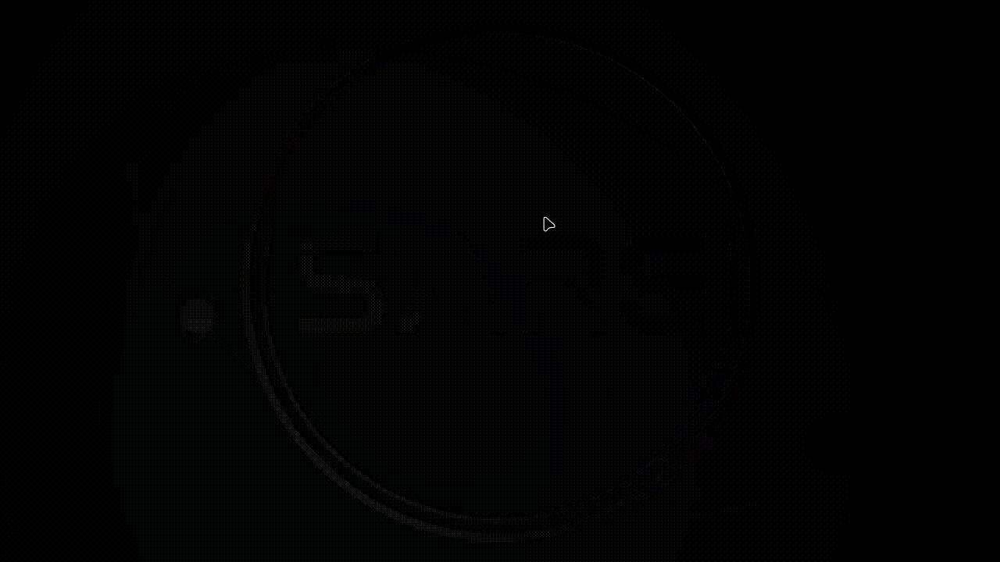

# SARE Logo Visualizer
A small application designed to run in a browser to visulize our logo in 3D, and it is used in our website's homepage.

Written in C++, compiled to WASM using `emscripten` for it to be able to run in a browser. Created assets and planned scene composition using [Blender](https://www.blender.org/).